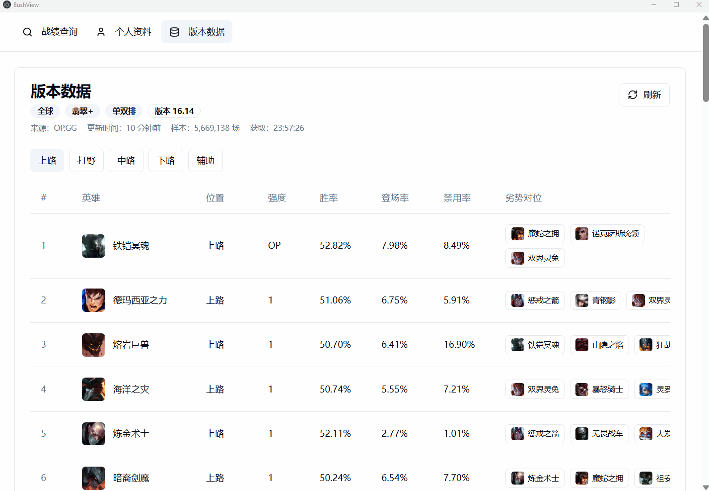

# BushView

基于 LCU API 的英雄联盟召唤师查询与对局数据分析工具。

BushView 目前主要面向 Windows 桌面端，目标是逐步追齐 op.gg 桌面客户端的核心体验。

## 功能

- 召唤师战绩查询(支持查询隐藏战绩)
- 版本数据查看(数据来源op.gg)

更多功能仍在开发中。

## 演示

| 个人资料 | 版本数据 |
| ------- | ------- |
|  |  |

## 安装与运行

### 运行要求

- 操作系统：当前仅支持 Windows
- 权限说明：由于需要通过 LCU API 与游戏客户端通信，必须以管理员身份运行程序，否则可能无法获取对局数据
- 游戏环境：运行前请确保英雄联盟客户端已启动并登录

### 下载

- 推荐前往 [Releases](https://github.com/kaiwe1/bush-view/releases) 页面下载最新版本
- v1.0.0 安装包：[bush-view-1.0.0.Setup.exe](https://github.com/kaiwe1/bush-view/releases/download/v1.0.0/bush-view-1.0.0.Setup.exe)

## 开发

### 环境要求

- Windows
- Node.js 和 npm
- 英雄联盟客户端已启动并登录
- 请用管理员权限启动终端，否则无法读取 LCU 进程参数导致无法进行战绩查询

### 常用命令

命令说明：

- `npm start`：启动 Electron Forge 进行开发
- `npm run lint`：运行 ESLint
- `npm run package`：只生成本地 package，不生成安装包
- `npm run make`：生成安装包，当前主要使用 Squirrel Windows maker
- `npm run publish`：运行 package 与 make命令, 并发布到 GitHub，配置见 `forge.config.ts`, 需要去Github上获取一个 fine-grained personal access tokens.

### 项目结构

```text
assets/                  应用图标等静态资源
docs/                    README 演示素材
src/main/                Electron 主进程
src/main/api/lcu.ts      LCU 凭证读取和本地 LCU API 请求
src/main/imageCache.ts   CommunityDragon 图片缓存和自定义协议支持
src/preload/             contextBridge 暴露给渲染进程的 API
src/components/ui/       通用基础 UI 组件
src/renderer/            React 渲染进程
src/renderer/app/        渲染进程应用外壳、导航和 tab 注册
src/renderer/features/   按功能分组的页面和业务组件
src/renderer/hooks/      渲染进程 React hooks
src/renderer/store/      Zustand 前端状态
src/shared/              主进程和渲染进程共享类型与常量
forge.config.ts          Electron Forge 打包和发布配置
```

### LCU 调用链路

1. `src/main/api/lcu.ts` 通过 `wmic` 查找 `LeagueClientUx.exe` 的启动参数
2. 从进程参数里提取 `--remoting-auth-token` 和 `--app-port`
3. 主进程向 `https://127.0.0.1:{port}` 发起 LCU 请求
4. `src/main/index.ts` 用 `ipcMain.handle` 注册主进程接口
5. `src/preload/index.ts` 通过 `contextBridge` 向渲染进程暴露 `window.electronAPI`
6. 渲染进程通过 `window.electronAPI` 获取数据

### 新增一个 LCU 接口

1. 在 `src/shared/types.ts` 补充返回值类型
2. 在 `src/main/api/lcu.ts` 新增请求函数
3. 在 `src/main/index.ts` 注册对应的 `ipcMain.handle`
4. 在 `src/preload/index.ts` 暴露方法
5. 在 `src/renderer/env.d.ts` 补齐 `window.electronAPI` 类型
6. 在 `src/renderer` 里的组件或 store 中调用

### 游戏资源缓存

游戏图片资源来自 CommunityDragon。渲染进程使用 `cached-cdragon://` URL 后，主进程会在 `src/main/imageCache.ts` 中把它转换为 HTTPS 请求，并缓存到 Electron 的 `userData/image-cache` 目录。

### 常见问题

- 提示“英雄联盟客户端未运行或 BushView 未以管理员权限运行”：确认客户端已登录，并以管理员权限运行应用或开发终端
- LCU 请求返回 404 或空数据：先确认对应接口在当前客户端版本仍存在，再检查传入的 `puuid`、`gameId` 或召唤师信息
- 图片加载慢：首次加载会从 CommunityDragon 下载，之后会走本地缓存
- op.gg 数据为空：`src/renderer/api/opgg.ts` 依赖网页 DOM 选择器，op.gg 页面结构变化时需要更新解析逻辑
- 发布后安装包没有立即出现在正式 Release：`forge.config.ts` 当前把 GitHub 发布配置为 `draft: true`

## 计划中

- [ ] 对局详情：经济曲线、击杀数据、中立资源
- [ ] 选择英雄时：自动检测当前对局，实时展示队友常用英雄、胜率及近期状态
- [ ] 自动接受对局、自动禁用英雄、自动选择英雄
- [ ] 支持非管理员模式运行或支持请求用户权限
- [ ] UI主题设置: light/dark mode, 瓦洛兰特大陆壁纸选择.

## 许可证

GNU GPL 3.0

## 致谢

- 符文 ID 对照表来自 [darkintaqt.com/blog/perk-ids](https://darkintaqt.com/blog/perk-ids)
- 游戏资源（装备、技能、英雄图标等）来自 [CommunityDragon](https://raw.communitydragon.org)

## 作者

kaiwei zhang (kaiwei.zhqwq@gmail.com)
