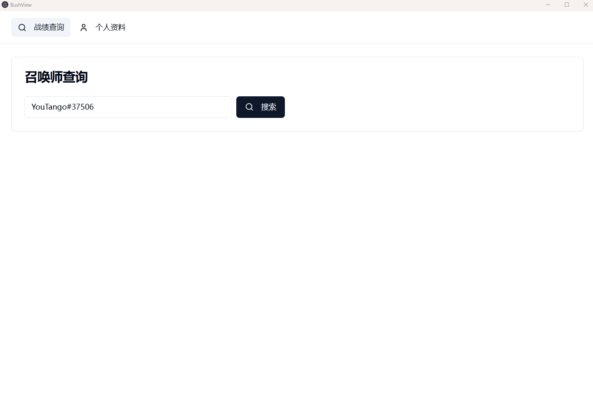
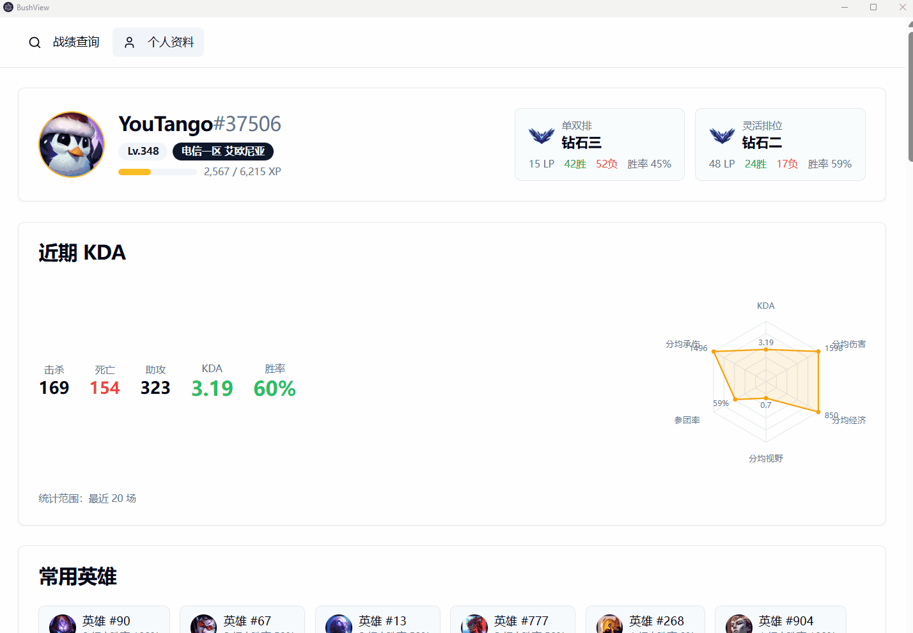

# BushView

基于LCU API的英雄联盟召唤师查询与对局数据分析工具

## 功能

- 召唤师查询
- 个人资料

更多功能还在开发中, 目标是追齐op.gg桌面客户端

## 演示

| 召唤师查询 | 对局详情 |
| --------- | ------- |
|  |  |

## 运行要求

- 操作系统：当前仅支持 Windows
- 权限说明：由于需要通过 LCU API 与游戏客户端通信，必须以管理员身份运行程序，否则可能无法获取对局数据。
- 游戏环境：运行前请确保英雄联盟客户端已启动并登录。

## 下载

- 安装包: [立即下载](https://github.com/kaiwe1/bush-view/releases/download/v1.0.0/bush-view-1.0.0.Setup.exe)
- 您也可以前往 [Releases](https://github.com/kaiwe1/bush-view/releases) 页面 下载其他版本

## 计划中
- [ ] 对局详情： 经济曲线、击杀数据、中立资源
- [ ] 选择英雄时： 自动检测当前对局，实时展示队友常用英雄、胜率及近期状态。
- [ ] 自动接受对局、自动禁用英雄
- [ ] op.gg版本英雄榜单
- [ ] 支持非管理员模式运行
- [ ] light/dark mode

## 许可证

GNU GPL 3.0 

## 致谢

- 符文 ID 对照表来自 [darkintaqt.com/blog/perk-ids](https://darkintaqt.com/blog/perk-ids)
- 游戏资源（装备、技能、英雄图标等）来自 [CommunityDragon](https://raw.communitydragon.org)

## 作者

kaiwei (me@kaiweizhang.com)

欢迎email我加feature!
